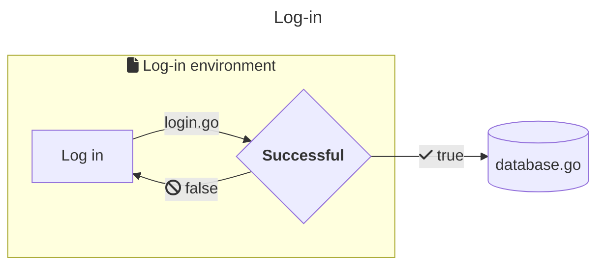
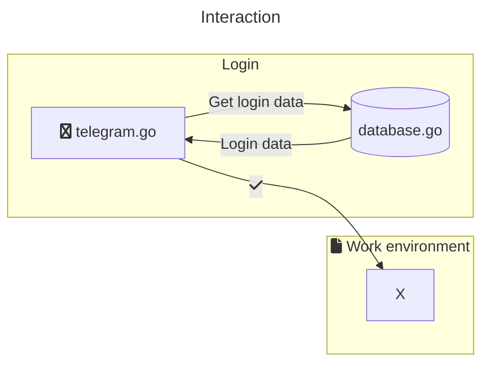

# telegram-tui


-----

**Table of Contents**

- [Installation](#installation)
- [License](#license)
- [Architecture](#architecture)

## Installation

```console
go build .
```

## License

`telegram-tui` is distributed under the terms of the [MIT](https://spdx.org/licenses/MIT.html) license.

## Architecture

`telegram-tui` has the following architecture (for visualisation, [mermaid](https://github.com/mermaid-js/mermaid) is used)




    